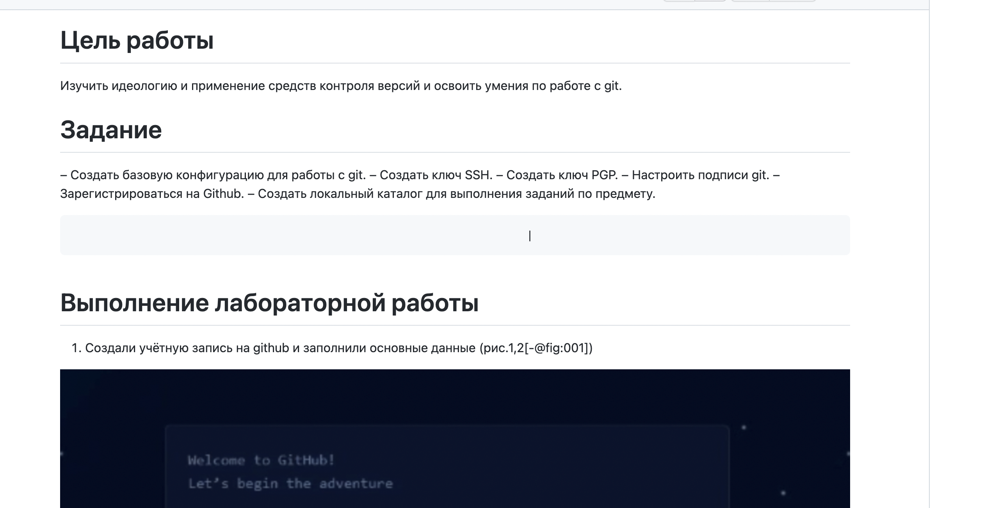

---
## Front matter
lang: ru-RU
title: Лабораторная работа №3 Markdown
author: |
	Федорина Эрнест Васильевич
institute: |
	\inst{1}RUDN University, Moscow, Russian Federation
	\and
	\inst{2}LIT JINR, Dubna, Russian Federation
	\and
	\inst{3}BLTP JINR, Dubna, Russian Federation
	\and
	\inst{4}Technical University of Košice, Košice, Slovakia
date: NEC--2019, 30 September -- 4 October, 2019 Budva, Montenegro

## Formatting
toc: false
slide_level: 2
theme: metropolis
header-includes: 
 - \metroset{progressbar=frametitle,sectionpage=progressbar,numbering=fraction}
 - '\makeatletter'
 - '\beamer@ignorenonframefalse'
 - '\makeatother'
aspectratio: 43
section-titles: true
---

# Введение

## Лабораторная работа №3(Markdown)

#  Содержание

- Введение-
- Результаты работы-
- Вывод

# Результаты работы

- Оформленный отчёт в markdown(рис.1)
- Сконвертированный в PDF и DOCX отчёт
{рис.1}

# Вывод
- Научились формлять отчёт с помощью markdown, а также ковертировать .md файлы в PDF и DOCX.
