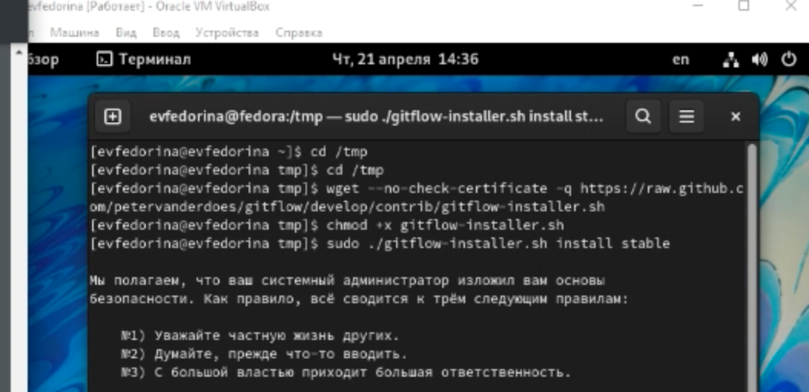
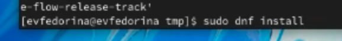
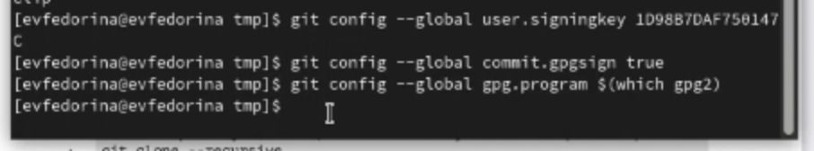

---
## Front matter
title: "Лабораторная работа 2"
subtitle: ""
author: "Федорина Эрнест Васильевич"

## Generic otions
lang: ru-RU
toc-title: "Содержание"

## Bibliography
bibliography: bib/cite.bib
csl: pandoc/csl/gost-r-7-0-5-2008-numeric.csl

## Pdf output format
toc: true # Table of contents
toc-depth: 2
lof: true # List of figures
lot: true # List of tables
fontsize: 12pt
linestretch: 1.5
papersize: a4
documentclass: scrreprt
## I18n polyglossia
polyglossia-lang:
  name: russian
  options:
	- spelling=modern
	- babelshorthands=true
polyglossia-otherlangs:
  name: english
## I18n babel
babel-lang: russian
babel-otherlangs: english
## Fonts
mainfont: PT Serif
romanfont: PT Serif
sansfont: PT Sans
monofont: PT Mono
mainfontoptions: Ligatures=TeX
romanfontoptions: Ligatures=TeX
sansfontoptions: Ligatures=TeX,Scale=MatchLowercase
monofontoptions: Scale=MatchLowercase,Scale=0.9
## Biblatex
biblatex: true
biblio-style: "gost-numeric"
biblatexoptions:
  - parentracker=true
  - backend=biber
  - hyperref=auto
  - language=auto
  - autolang=other*
  - citestyle=gost-numeric
## Pandoc-crossref LaTeX customization
figureTitle: "Рис."
tableTitle: "Таблица"
listingTitle: "Листинг"
lofTitle: "Список иллюстраций"
lotTitle: "Список таблиц"
lolTitle: "Листинги"
## Misc options
indent: true
header-includes:
  - \usepackage{indentfirst}
  - \usepackage{float} # keep figures where there are in the text
  - \floatplacement{figure}{H} # keep figures where there are in the text
---

# Цель работы

Изучить идеологию и применение средств контроля версий и освоить умения по
работе с git.

# Задание

– Создать базовую конфигурацию для работы с git.
– Создать ключ SSH.
– Создать ключ PGP.
– Настроить подписи git.
– Зарегистрироваться на Github.
– Создать локальный каталог для выполнения заданий по предмету.

# Теоретическое введение
                                                                           |
# Выполнение лабораторной работы

1. Создали учётную запись на github и заполнили основные данные (рис.1,2[-@fig:001])

{ #fig:001 width=70% }
{ #fig:001 width=70% }

2. Установил git-flow в Fedora Linux вручную(рис.3,4[-@fig:001])
{ #fig:001 width=70% }
{ #fig:001 width=70% }

3.Установил gh в Fedora Linux(рис.5,6[-@fig:001])
{ #fig:001 width=70% }
{ #fig:001 width=70% }

4. Настроили git(Задали имя и email владельца репозитория, настроили
кодировку utf-8, верификацию и подписание коммитов, задали имя начальной
ветки, а также параметры autocrlf и safecrlf(рис.7[-@fig:001])
{ #fig:001 width=70% }

5. Создали ключи ssh(рис.8,9[-@fig:001])
{ #fig:001 width=70% }
{ #fig:001 width=70% }

6. Создали pgp ключ(рис.8,9[-@fig:001])
{ #fig:001 width=70% }
{ #fig:001 width=70% }

7. Добавили pgp ключ на github(рис.12,13,14[-@fig:001])
{ #fig:001 width=70% }
{ #fig:001 width=70% }
{ #fig:001 width=70% }

8. Настроили автоматические подписи коммитов git(рис.15[-@fig:001])
{ #fig:001 width=70% }

9. Авторизовались(рис.16-@fig:001])
{ #fig:001 width=70% }

10. Создали репозиторий курса на основе шаблона(рис.3,4[-@fig:001])
{ #fig:001 width=70% }
{ #fig:001 width=70% }

11. Настроили каталог курса(убрали лишние файлы, сделали необходимые
каталоги и отправили файлы на сервер)(рис.17,18,19:001])
![рис.17image/17.png){ #fig:001 width=70% }
![рис.18image/18.png){ #fig:001 width=70% }
![рис.19image/19.png){ #fig:001 width=70% }

# Выводы

Изучили идеологию и применение средств контроля версий и освоили умения по
работе с git.
