---
## Front matter
title: "Отчёт по лабораторной работе №3"
subtitle: "Markdown"
author: "Федорина Эрнест Васильевич"

## Generic otions
lang: ru-RU
toc-title: "Содержание"

## Bibliography
bibliography: bib/cite.bib
csl: pandoc/csl/gost-r-7-0-5-2008-numeric.csl

## Pdf output format
toc: true # Table of contents
toc-depth: 2
lof: true # List of figures
lot: true # List of tables
fontsize: 12pt
linestretch: 1.5
papersize: a4
documentclass: scrreprt
## I18n polyglossia
polyglossia-lang:
  name: russian
  options:
	- spelling=modern
	- babelshorthands=true
polyglossia-otherlangs:
  name: english
## I18n babel
babel-lang: russian
babel-otherlangs: english
## Fonts
mainfont: PT Serif
romanfont: PT Serif
sansfont: PT Sans
monofont: PT Mono
mainfontoptions: Ligatures=TeX
romanfontoptions: Ligatures=TeX
sansfontoptions: Ligatures=TeX,Scale=MatchLowercase
monofontoptions: Scale=MatchLowercase,Scale=0.9
## Biblatex
biblatex: true
biblio-style: "gost-numeric"
biblatexoptions:
  - parentracker=true
  - backend=biber
  - hyperref=auto
  - language=auto
  - autolang=other*
  - citestyle=gost-numeric
## Pandoc-crossref LaTeX customization
figureTitle: "Рис."
tableTitle: "Таблица"
listingTitle: "Листинг"
lofTitle: "Список иллюстраций"
lotTitle: "Список таблиц"
lolTitle: "Листинги"
## Misc options
indent: true
header-includes:
  - \usepackage{indentfirst}
  - \usepackage{float} # keep figures where there are in the text
  - \floatplacement{figure}{H} # keep figures where there are in the text
---

# Цель работы

Научиться оформлять отчёты с помощью легковесного языка разметки Markdown.

# Задание

– Сделайте отчёт по предыдущей лабораторной работе в формате Markdown.
– В качестве отчёта просьба предоставить отчёты в 3 форматах: pdf, docx и md (в архиве,
поскольку он должен содержать скриншоты, Makefile и т.д.)

# Теоретическое введение

Markdown — облегчённый язык разметки, созданный с целью обозначения форматирования в простом тексте, с максимальным сохранением его читаемости человеком, и пригодный для машинного преобразования в языки для продвинутых публикаций (HTML, Rich Text и других).

# Выполнение лабораторной работы

# Заходим в github и переходим в режим редактирования шаблона отчёта (рис. 1)

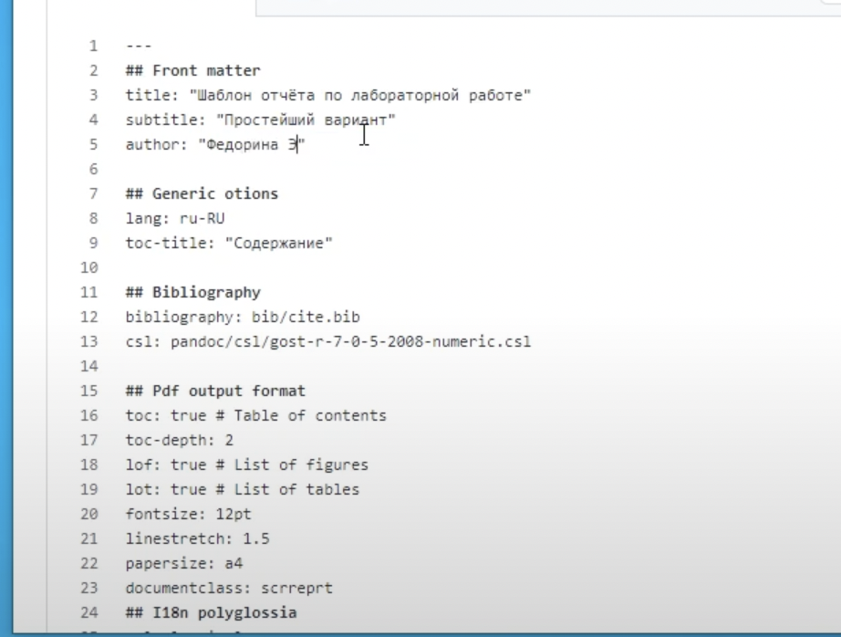{рис.1}

# Сохраняем скриншоты из отчёта второй лабораторной работы на компьютер (рис. 2)

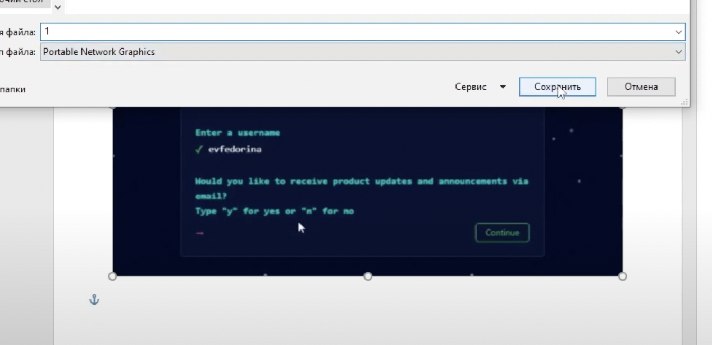{рис.2}

# Загружаем скриншоты на github (рис. 3)

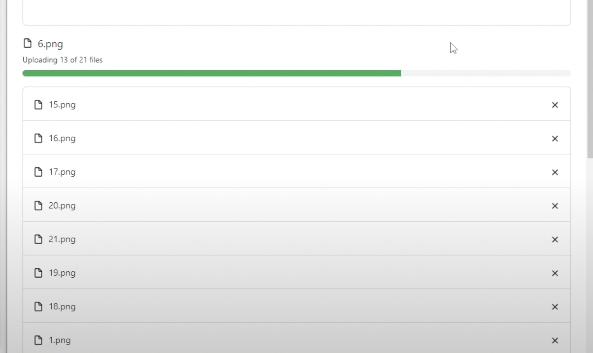{рис.3}

# Редактируем файл, делаем ссылки к скриншотам, переносим информацию из прошлого отчёта (рис. 4)

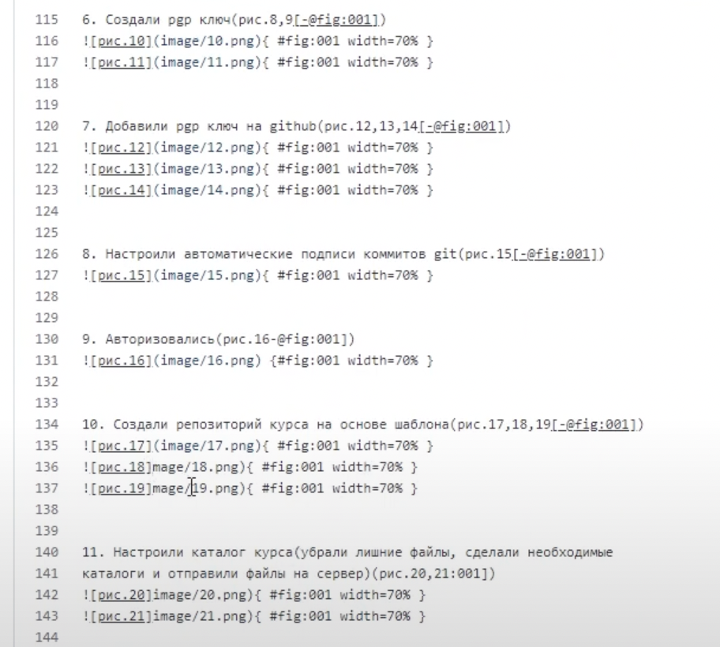{рис.4}

# Заходим в виртуальную машину и копируем репозиторий в папку, чтобы в дальнейшем извлечь отчёт в формате .md (рис. 5)

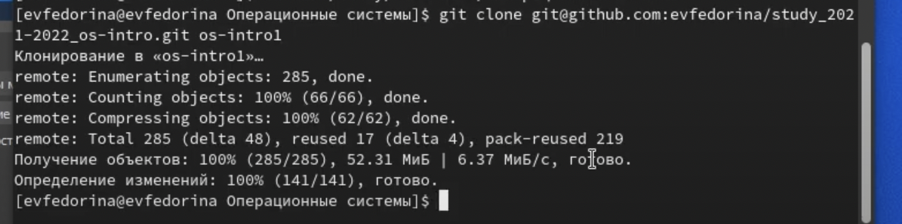{рис.5}

# Скачиваем и устанавливаем pandoc  и pandoc crossref на компьютер(не на виртуальную машину) (рис. 6) и (рис. 7)

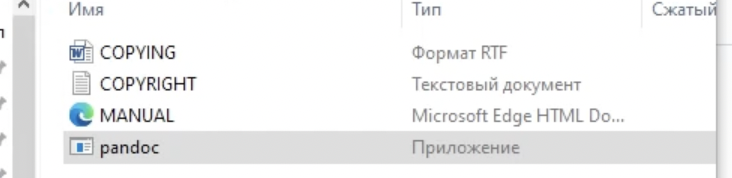{рис.6}
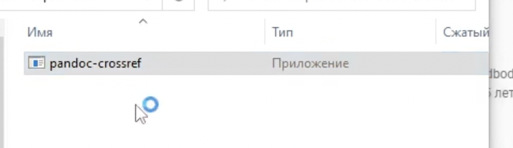{рис.7}

 # В виртуальной машине загружаем файл с отчётом в облачное хранилище, скачиваем его же с основной системы (рис. 8)(рис. 9)

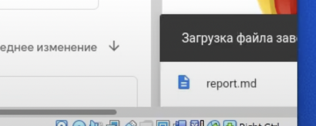{рис.8}
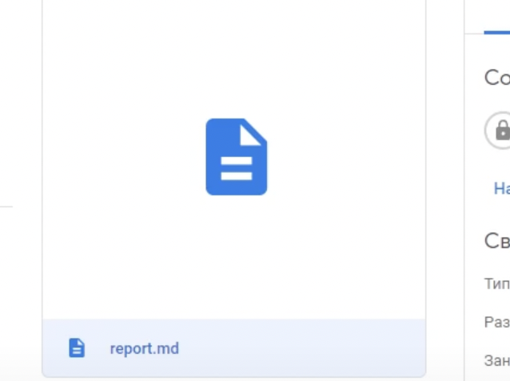{рис.9}

# Копируем все скриншоты в созданную папку image в папке с report.md (рис. 10)

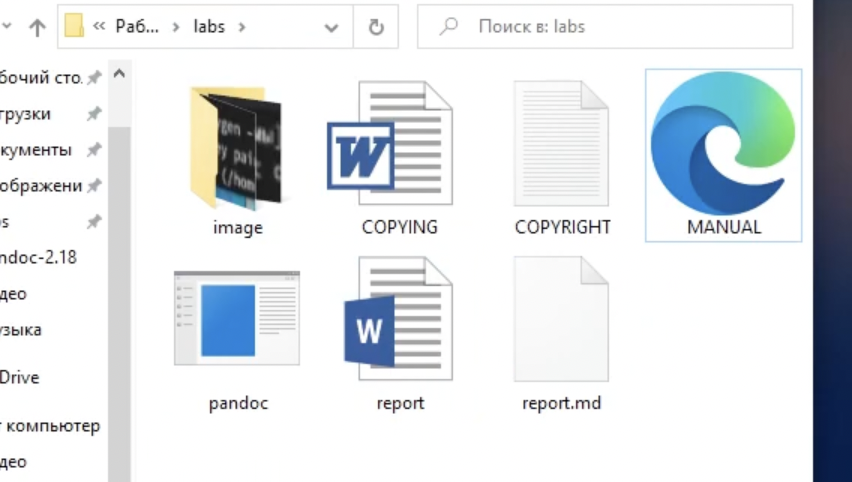{рис.10}

# Открываем командную строку и с помощью pandoс создаём файл с отчётом в формате docx (рис. 11)(рис. 12)

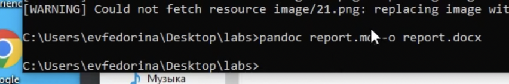{рис.11}
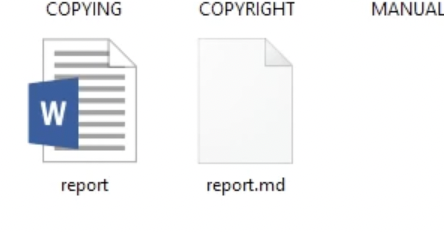{рис.12}

# Заходим на онлайн конвертатор и конвертируем файл docx в pdf(рис. 13)(рис. 14)

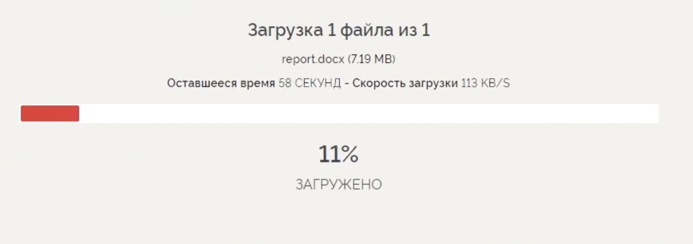{рис.13}
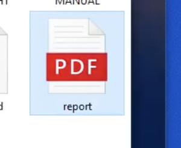{рис.14}

# Выводы
Научились оформлять отчёты с помощью легковесного языка разметки Markdown. Создали отчёт в трёх форматах: md,docx,pdf
