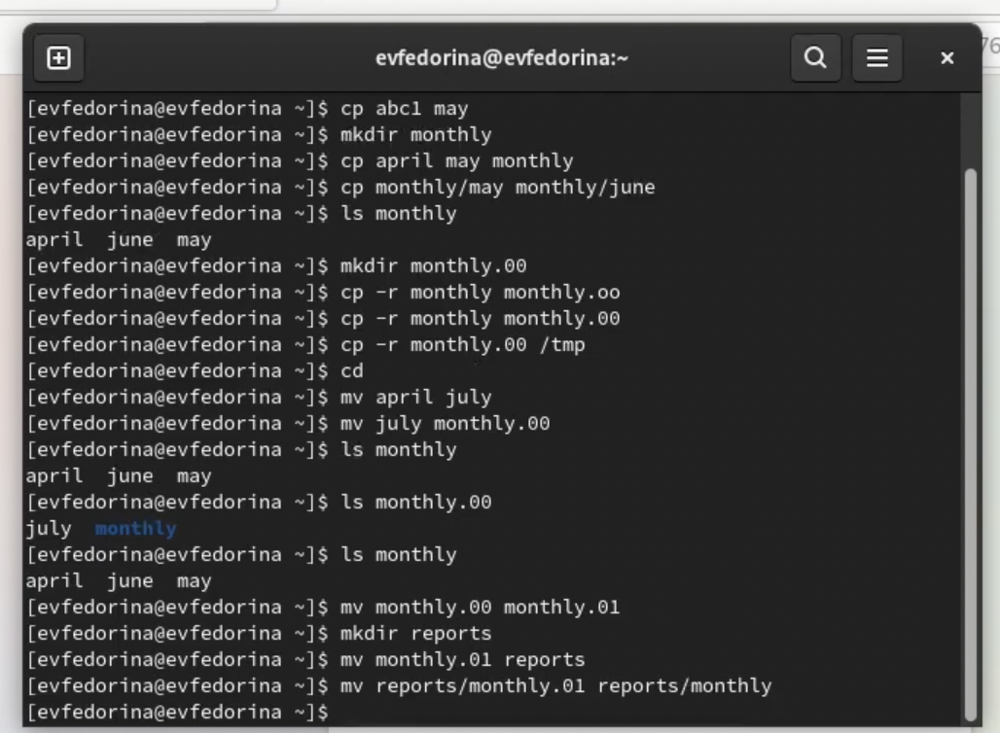
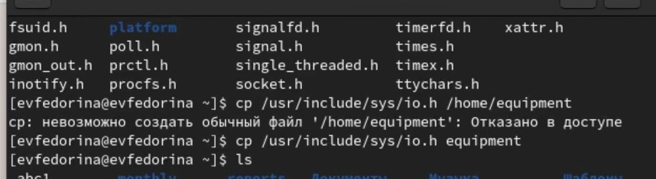
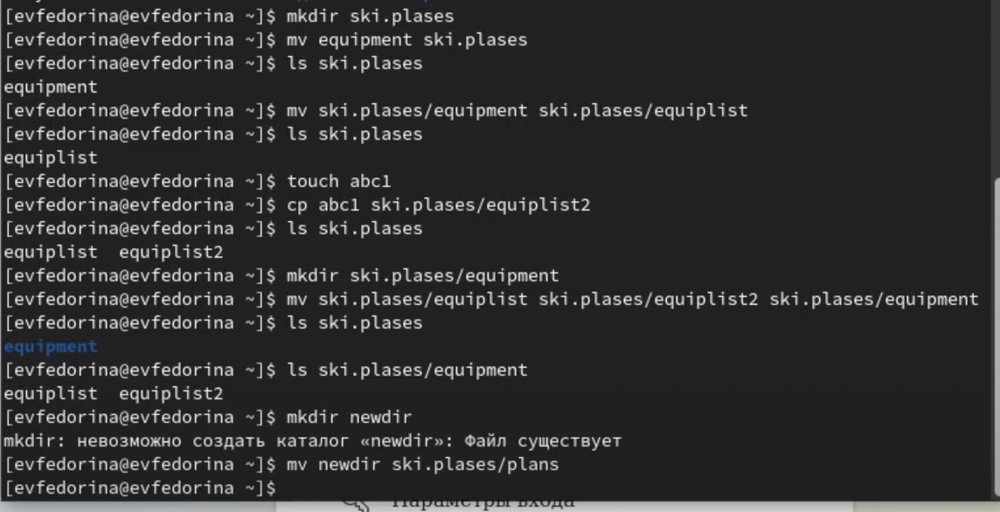
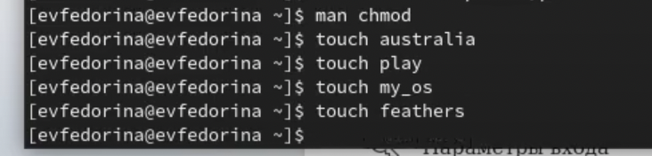
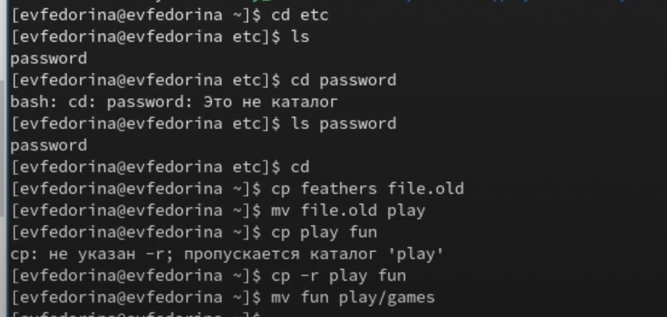
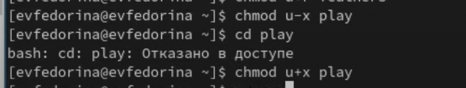
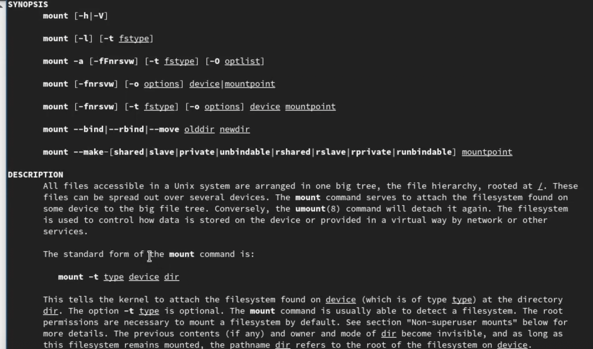

---
## Front matter
title: "Отчёт по лабораторной работе №5"
subtitle: " Анализ файловой системы Linux.
Команды для работы с файлами и каталогами"
author: "Федорина Эрнест Васильевич НКНбд-01-21"

## Generic otions
lang: ru-RU
toc-title: "Содержание"

## Bibliography
bibliography: bib/cite.bib
csl: pandoc/csl/gost-r-7-0-5-2008-numeric.csl

## Pdf output format
toc: true # Table of contents
toc-depth: 2
lof: true # List of figures
lot: true # List of tables
fontsize: 12pt
linestretch: 1.5
papersize: a4
documentclass: scrreprt
## I18n polyglossia
polyglossia-lang:
  name: russian
  options:
	- spelling=modern
	- babelshorthands=true
polyglossia-otherlangs:
  name: english
## I18n babel
babel-lang: russian
babel-otherlangs: english
## Fonts
mainfont: PT Serif
romanfont: PT Serif
sansfont: PT Sans
monofont: PT Mono
mainfontoptions: Ligatures=TeX
romanfontoptions: Ligatures=TeX
sansfontoptions: Ligatures=TeX,Scale=MatchLowercase
monofontoptions: Scale=MatchLowercase,Scale=0.9
## Biblatex
biblatex: true
biblio-style: "gost-numeric"
biblatexoptions:
  - parentracker=true
  - backend=biber
  - hyperref=auto
  - language=auto
  - autolang=other*
  - citestyle=gost-numeric
## Pandoc-crossref LaTeX customization
figureTitle: "Рис."
tableTitle: "Таблица"
listingTitle: "Листинг"
lofTitle: "Список иллюстраций"
lotTitle: "Список таблиц"
lolTitle: "Листинги"
## Misc options
indent: true
header-includes:
  - \usepackage{indentfirst}
  - \usepackage{float} # keep figures where there are in the text
  - \floatplacement{figure}{H} # keep figures where there are in the text
---

# Цель работы
Ознакомление с файловой системой Linux, её структурой, именами и содержанием
каталогов. Приобретение практических навыков по применению команд для работы
с файлами и каталогами, по управлению процессами (и работами), по проверке использования диска и обслуживанию файловой системы

# Задание

Выполните все примеры, приведённые в первой части описания лабораторной работы.

2. Выполните следующие действия, зафиксировав в отчёте по лабораторной работе
используемые при этом команды и результаты их выполнения:

2.1. Скопируйте файл /usr/include/sys/io.h в домашний каталог и назовите его
equipment. Если файла io.h нет, то используйте любой другой файл в каталоге
/usr/include/sys/ вместо него.

2.2. В домашнем каталоге создайте директорию ~/ski.plases.

2.3. Переместите файл equipment в каталог ~/ski.plases.

2.4. Переименуйте файл ~/ski.plases/equipment в ~/ski.plases/equiplist.

2.5. Создайте в домашнем каталоге файл abc1 и скопируйте его в каталог
~/ski.plases, назовите его equiplist2.

2.6. Создайте каталог с именем equipment в каталоге ~/ski.plases.

2.7. Переместите файлы ~/ski.plases/equiplist и equiplist2 в каталог
~/ski.plases/equipment.

2.8. Создайте и переместите каталог ~/newdir в каталог ~/ski.plases и назовите
его plans.

3. Определите опции команды chmod, необходимые для того, чтобы присвоить перечисленным ниже файлам выделенные права доступа, считая, что в начале таких прав
нет:

3.1. drwxr--r-- ... australia

3.2. drwx--x--x ... play

3.3. -r-xr--r-- ... my_os

3.4. -rw-rw-r-- ... feathers

При необходимости создайте нужные файлы.

4. Проделайте приведённые ниже упражнения, записывая в отчёт по лабораторной
работе используемые при этом команды:

4.1. Просмотрите содержимое файла /etc/password.

4.2. Скопируйте файл ~/feathers в файл ~/file.old.

4.3. Переместите файл ~/file.old в каталог ~/play.

4.4. Скопируйте каталог ~/play в каталог ~/fun.

4.5. Переместите каталог ~/fun в каталог ~/play и назовите его games.

4.6. Лишите владельца файла ~/feathers права на чтение.

4.7. Что произойдёт, если вы попытаетесь просмотреть файл ~/feathers командой
cat?

4.8. Что произойдёт, если вы попытаетесь скопировать файл ~/feathers?

4.9. Дайте владельцу файла ~/feathers право на чтение.

4.10. Лишите владельца каталога ~/play права на выполнение.

4.11. Перейдите в каталог ~/play. Что произошло?

4.12. Дайте владельцу каталога ~/play право на выполнение.

5. Прочитайте man по командам mount, fsck, mkfs, kill и кратко их охарактеризуйте,
приведя примеры.

# Теоретическое введение

Для создания текстового файла можно использовать команду touch.
Формат команды:
`touch имя-файла`

Для просмотра файлов небольшого размера можно использовать команду cat.
Формат команды:

`cat имя-файла`

Для просмотра файлов постранично удобнее использовать команду less.
Формат команды:

`less имя-файла`

Следующие клавиши используются для управления процессом просмотра:
– Space — переход к следующей странице,
– ENTER — сдвиг вперёд на одну строку,
– b — возврат на предыдущую страницу,
– h — обращение за подсказкой,
– q — выход из режима просмотра файла.
Команда head выводит по умолчанию первые 10 строк файла.
Формат команды:

`head [-n] имя-файла`

где n — количество выводимых строк.
Команда tail выводит умолчанию 10 последних строк файла.
Формат команды:

`tail [-n] имя-файла`

где n — количество выводимых строк.

# Выполнение лабораторной работы

Выполняем все примеры из первой части указаний к лабораторной работе.(рис.1)

{рис.1}

Скопировали файл /usr/include/sys/io.h в домашний каталог и назвали его
equipment.(рис.2)

{рис.2}

Задание 2(рис.3)
- В домашнем каталоге создали  ~/ski.plases.

`mkdir ski.plases`

- Переместили файл equipment в каталог ~/ski.plases.

`mv equipment ski.plases`

- Переименовали файл ~/ski.plases/equipment в ~/ski.plases/equiplist.

`mv ski.plases/equipment ski.plases/equiplist`

- Создали в домашнем каталоге файл abc1 и скопировали его в каталог
~/ski.plases, назвали его equiplist2.

`cp abc1 ski.plases/equiplist2`

- Создайли каталог с именем equipment в каталоге ~/ski.plases.
`mkdir ski.plases/equipment`

- Переместите файлы ~/ski.plases/equiplist и equiplist2 в каталог
~/ski.plases/equipment.
`mv ski.plases/equiplist ski.plases/equiplist2 ski.plases/equipment`

- Создали и переместили каталог ~/newdir в каталог ~/ski.plases и назовите
его plans.

`mv newdir ski.plases/plans`

{рис.3}

{рис.4}

{рис.5}

{рис.6}

{рис.8}

{рис.9}

{рис.10}

# Выводы
Ознакомились с файловой системой Linux, её структурой, именами и содержанием
каталогов. Приобрели практические навыки по применению команд для работы
с файлами и каталогами, по управлению процессами (и работами), по проверке использования диска и обслуживанию файловой системы

