---
## Front matter
title: "Отчёт по лабораторной работе №6"
subtitle: " Поиск файлов. Перенаправление
ввода-вывода. Просмотр запущенных процессов "
author: "Федорина Эрнест Васильевич НКНбд-01-21"

## Generic otions
lang: ru-RU
toc-title: "Содержание"

## Bibliography
bibliography: bib/cite.bib
csl: pandoc/csl/gost-r-7-0-5-2008-numeric.csl

## Pdf output format
toc: true # Table of contents
toc-depth: 2
lof: true # List of figures
lot: true # List of tables
fontsize: 12pt
linestretch: 1.5
papersize: a4
documentclass: scrreprt
## I18n polyglossia
polyglossia-lang:
  name: russian
  options:
	- spelling=modern
	- babelshorthands=true
polyglossia-otherlangs:
  name: english
## I18n babel
babel-lang: russian
babel-otherlangs: english
## Fonts
mainfont: PT Serif
romanfont: PT Serif
sansfont: PT Sans
monofont: PT Mono
mainfontoptions: Ligatures=TeX
romanfontoptions: Ligatures=TeX
sansfontoptions: Ligatures=TeX,Scale=MatchLowercase
monofontoptions: Scale=MatchLowercase,Scale=0.9
## Biblatex
biblatex: true
biblio-style: "gost-numeric"
biblatexoptions:
  - parentracker=true
  - backend=biber
  - hyperref=auto
  - language=auto
  - autolang=other*
  - citestyle=gost-numeric
## Pandoc-crossref LaTeX customization
figureTitle: "Рис."
tableTitle: "Таблица"
listingTitle: "Листинг"
lofTitle: "Список иллюстраций"
lotTitle: "Список таблиц"
lolTitle: "Листинги"
## Misc options
indent: true
header-includes:
  - \usepackage{indentfirst}
  - \usepackage{float} # keep figures where there are in the text
  - \floatplacement{figure}{H} # keep figures where there are in the text
---

# Цель работы
Ознакомление с инструментами поиска файлов и фильтрации текстовых данных.
Приобретение практических навыков: по управлению процессами (и заданиями), по
проверке использования диска и обслуживанию файловых систем.

# Задание

1. Осуществите вход в систему, используя соответствующее имя пользователя.
2. Запишите в файл file.txt названия файлов, содержащихся в каталоге /etc. Допишите в этот же файл названия файлов, содержащихся в вашем домашнем каталоге.
3. Выведите имена всех файлов из file.txt, имеющих расширение .conf, после чего
запишите их в новый текстовой файл conf.txt.
Кулябов Д. С. и др. Операционные системы 59
4. Определите, какие файлы в вашем домашнем каталоге имеют имена, начинавшиеся
с символа c? Предложите несколько вариантов, как это сделать.
5. Выведите на экран (по странично) имена файлов из каталога /etc, начинающиеся
с символа h.
6. Запустите в фоновом режиме процесс, который будет записывать в файл ~/logfile
файлы, имена которых начинаются с log.
7. Удалите файл ~/logfile.
8. Запустите из консоли в фоновом режиме редактор gedit.
9. Определите идентификатор процесса gedit, используя команду ps, конвейер и фильтр
grep. Как ещё можно определить идентификатор процесса?
10. Прочтите справку (man) команды kill, после чего используйте её для завершения
процесса gedit.
11. Выполните команды df и du, предварительно получив более подробную информацию
об этих командах, с помощью команды man.
12. Воспользовавшись справкой команды find, выведите имена всех директорий, имеющихся в вашем домашнем каталоге.

# Теоретическое введение

В системе по умолчанию открыто три специальных потока:
– stdin — стандартный поток ввода (по умолчанию: клавиатура), файловый дескриптор
0;
– stdout — стандартный поток вывода (по умолчанию: консоль), файловый дескриптор
1;
– stderr — стандартный поток вывод сообщений об ошибках (по умолчанию: консоль),
файловый дескриптор 2.
Большинство используемых в консоли команд и программ записывают результаты
своей работы в стандартный поток вывода stdout. Например, команда ls выводит в стандартный поток вывода (консоль) список файлов в текущей директории. Потоки вывода
и ввода можно перенаправлять на другие файлы или устройства. Проще всего это делается
с помощью символов >, >>, <, <<. Рассмотрим пример.

` # Перенаправление stdout (вывода) в файл.`
` # Если файл отсутствовал, то он создаётся,`
` # иначе -- перезаписывается.`
` # Создаёт файл, содержащий список дерева каталогов.`
` ls -lR > dir-tree.list`
` 1>filename`
` # Перенаправление вывода (stdout) в файл "filename".`
` 1>>filename
` # Перенаправление вывода (stdout) в файл "filename",`
` # файл открывается в режиме добавления.`
` 2>filename`
` # Перенаправление stderr в файл "filename".`
` 2>>filename`
` # Перенаправление stderr в файл "filename",`
` # файл открывается в режиме добавления.`
` &>filename`
` # Перенаправление stdout и stderr в файл "filename".`

# Выполнение лабораторной работы

Записали в файл file.txt названия файлов в  /etc и названия файлов в домашнем каталоге(рис.1)

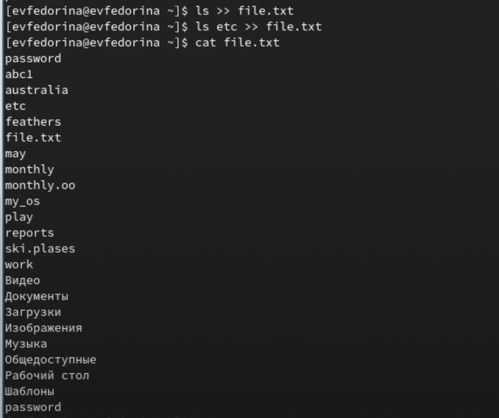{рис.1}

Вывели имена всех файлов с расширешием .conf и записали их в отдельный файл(рис.2)
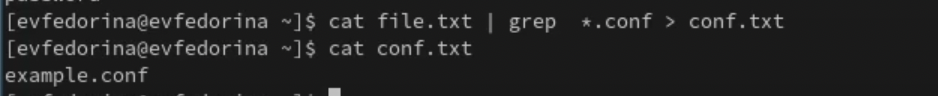{рис.2}

Нашли все файлы, начинающиеся с "c"(рис.3)

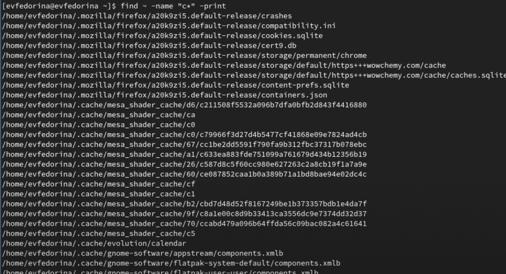{рис.3}

Нашли все файлы из /etc6 начинающихся с "h"(рис.4)

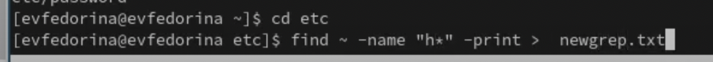{рис.4}

Запустили процесс нахождение файлов, начинающихся с log в фоновом режиме(рис.5)
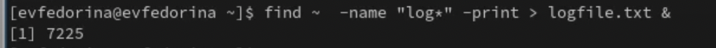{рис.5}

Удалили logfile.txt(рис.6)

{рис.6}

Запустили gedit в фоновом режиме(рис.7)

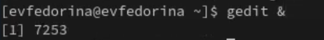{рис.7}

Нашли индентификатор процесса gedit(рис.8)

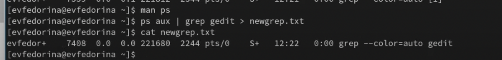{рис.8}

 С помощью kill завершили процесс gedit(рис.9)
 
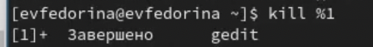{рис.9}

Изучили команды df и du и запустили их(рис.10.11)

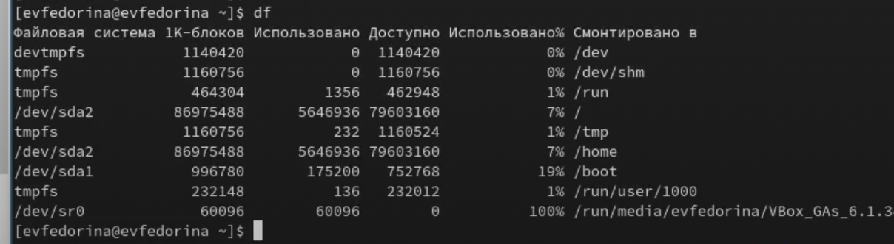{рис.10}

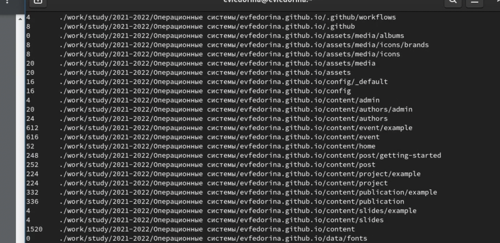{рис.11}

Вывели имена всех директорий домашнего каталога(рис. 12.13)

{рис.12}

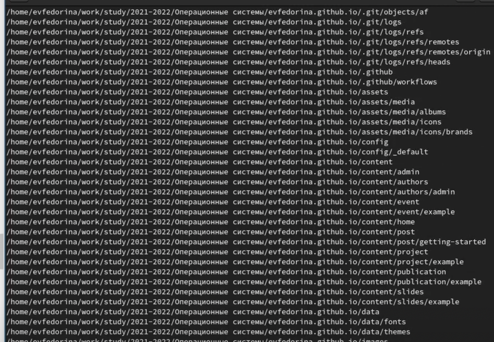{рис.13}

# Выводы
Ознакомились с инструментами поиска файлов и фильтрации текстовых данных.
Приобрели практические навыки: по управлению процессами (и заданиями), по
проверке использования диска и обслуживанию файловых систем.

