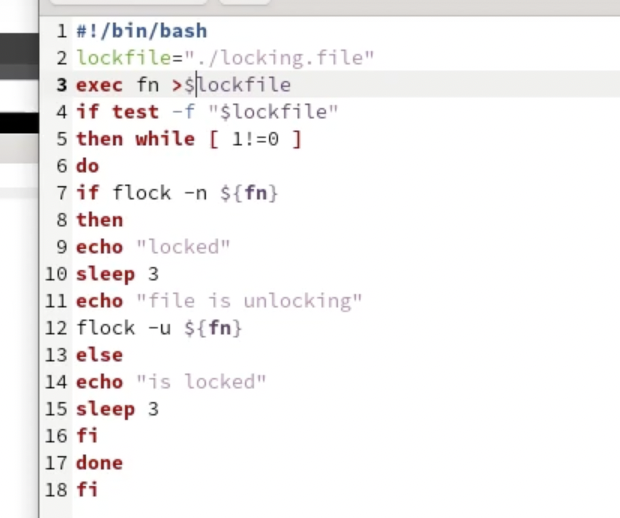
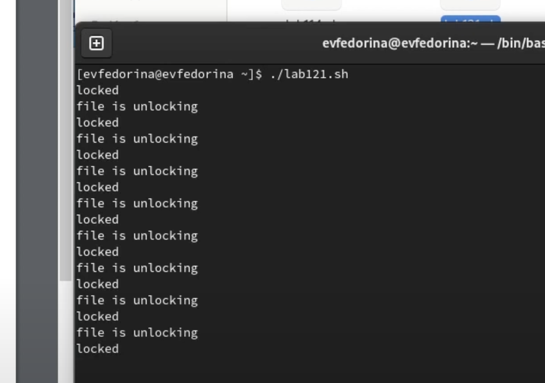
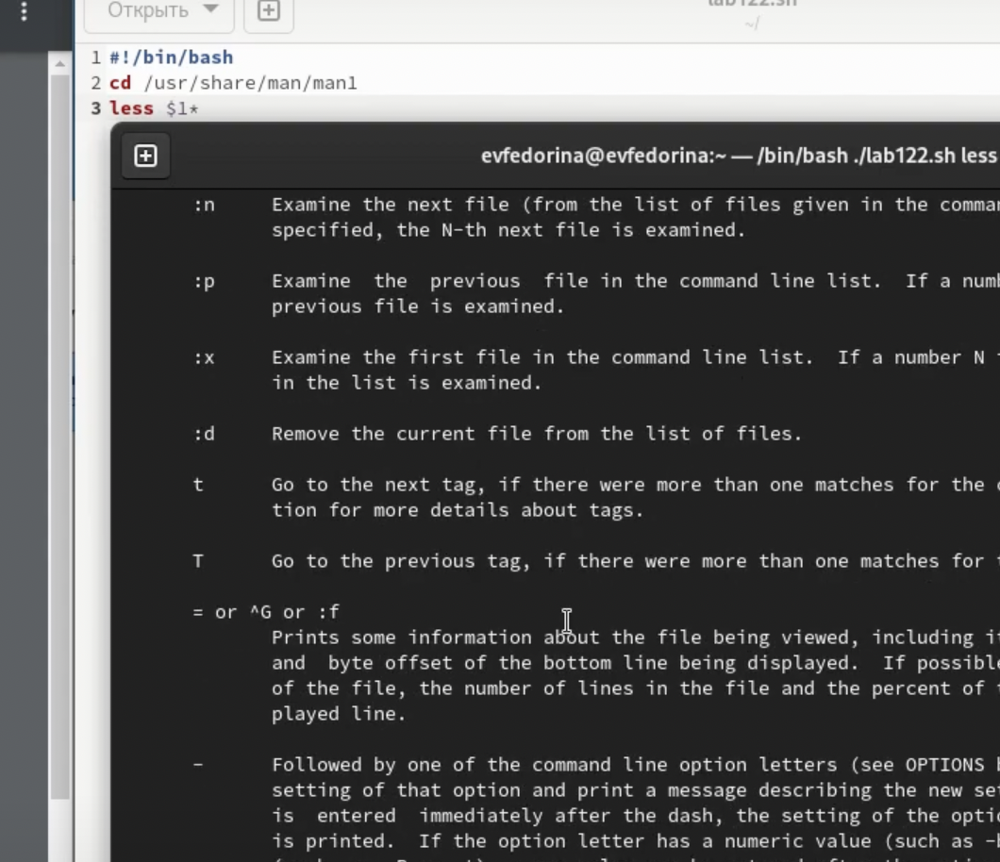
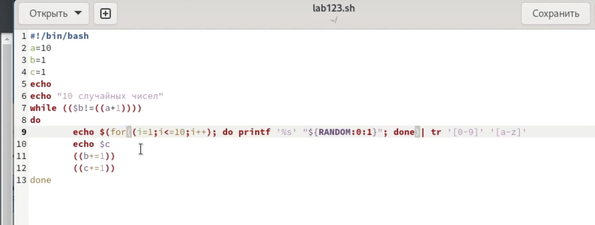
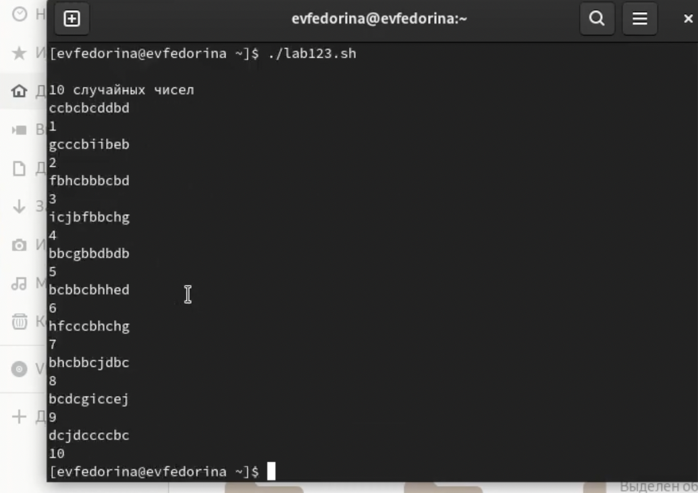

---
## Front matter
title: "Отчёт по лабораторной работе №12"
subtitle: " Программирование в командном
процессоре ОС UNIX. Расширенное программирование "
author: "Федорина Эрнест Васильевич НКНбд-01-21"

## Generic otions
lang: ru-RU
toc-title: "Содержание"

## Bibliography
bibliography: bib/cite.bib
csl: pandoc/csl/gost-r-7-0-5-2008-numeric.csl

## Pdf output format
toc: true # Table of contents
toc-depth: 2
lof: true # List of figures
lot: true # List of tables
fontsize: 12pt
linestretch: 1.5
papersize: a4
documentclass: scrreprt
## I18n polyglossia
polyglossia-lang:
  name: russian
  options:
	- spelling=modern
	- babelshorthands=true
polyglossia-otherlangs:
  name: english
## I18n babel
babel-lang: russian
babel-otherlangs: english
## Fonts
mainfont: PT Serif
romanfont: PT Serif
sansfont: PT Sans
monofont: PT Mono
mainfontoptions: Ligatures=TeX
romanfontoptions: Ligatures=TeX
sansfontoptions: Ligatures=TeX,Scale=MatchLowercase
monofontoptions: Scale=MatchLowercase,Scale=0.9
## Biblatex
biblatex: true
biblio-style: "gost-numeric"
biblatexoptions:
  - parentracker=true
  - backend=biber
  - hyperref=auto
  - language=auto
  - autolang=other*
  - citestyle=gost-numeric
## Pandoc-crossref LaTeX customization
figureTitle: "Рис."
tableTitle: "Таблица"
listingTitle: "Листинг"
lofTitle: "Список иллюстраций"
lotTitle: "Список таблиц"
lolTitle: "Листинги"
## Misc options
indent: true
header-includes:
  - \usepackage{indentfirst}
  - \usepackage{float} # keep figures where there are in the text
  - \floatplacement{figure}{H} # keep figures where there are in the text
---

# Цель работы

Изучить основы программирования в оболочке ОС UNIX. Научиться писать более
сложные командные файлы с использованием логических управляющих конструкций
и циклов.

# Задание

1. Написать командный файл, реализующий упрощённый механизм семафоров. Командный файл должен в течение некоторого времени t1 дожидаться освобождения
ресурса, выдавая об этом сообщение, а дождавшись его освобождения, использовать
его в течение некоторого времени t2<>t1, также выдавая информацию о том, что
ресурс используется соответствующим командным файлом (процессом). Запустить
командный файл в одном виртуальном терминале в фоновом режиме, перенаправив
его вывод в другой (> /dev/tty#, где # — номер терминала куда перенаправляется
вывод), в котором также запущен этот файл, но не фоновом, а в привилегированном
режиме. Доработать программу так, чтобы имелась возможность взаимодействия трёх
и более процессов.
2. Реализовать команду man с помощью командного файла. Изучите содержимое каталога /usr/share/man/man1. В нем находятся архивы текстовых файлов, содержащих
справку по большинству установленных в системе программ и команд. Каждый архив
можно открыть командой less сразу же просмотрев содержимое справки. Командный
файл должен получать в виде аргумента командной строки название команды и в виде
результата выдавать справку об этой команде или сообщение об отсутствии справки,
если соответствующего файла нет в каталоге man1.
3. Используя встроенную переменную $RANDOM, напишите командный файл, генерирующий случайную последовательность букв латинского алфавита. Учтите, что $RANDOM
выдаёт псевдослучайные числа в диапазоне от 0 до 32767.

# Теоретическое введение

При интерактивной работе с операционной системой пользователь постоянно сталкивается с необходимостью отдавать ей команды. В UNIX эту работу выполняет программа, которая называется командным процессором (shell). Иногда командный процессор называют шеллом или оболочкой, или интерпретатором команд (последнее неточно, потому что круг задач командного процессора шире, чем интерпретация команд).

Shell действует как посредник между вами и ядром операционной системы. Ядро – это часть операционной системы, которая всегда находится в памяти компьютера, это программа. Командный процессор преобразует ваши команды в инструкции для операционной системы, а операционная система превращает их в инструкции для аппаратных средств компьютера. По сути, именно оболочка придает определенную “персонализацию” системам UNIX.

Командный процессор выполняет в системе следующие задачи:

- интерпретация команд пользователя, в том числе разбор командной строки;

- запуск программ;

- организация перенаправлений потоков между процессами;

- интерпретация языка скриптов и их выполнение;

- управление заданиями;

- интерпретация шаблонов имен файлов;

- подстановка имен файлов в командную строку.

Кроме того, shell является мощным языком программирования.

Любая команда, являющаяся отдельной программой, т.е. не встроенной в интерпретатор, будет выполняться одинаково, независимо от shell'a. Например, если вы хотите что–то напечатать, команда печати всегда работает одинаково.

Некоторые команды встроены в shell, т.е. они являются частью программы оболочки и, как следствие, могут выполняться по-разному в зависимости от оболочки, в которой они запускаются. Есть три вида команд, встроенных в shell:

- общие команды запускаются несколько быстрее, так как они являются частью оболочки;

- команды адаптации позволяют адаптировать оболочку;

- команды программирования образуют язык программирования оболочки.

При смене shell'a вы не заметите никакой разницы между общими командами, которые встроены просто для повышения быстродействия. Однако команды адаптации и программирования изменяются.

Примером общих команд, встроенных в оболочку, служат команды cd, echo, pwd, login, umask.

Адаптация включает в себя создание новых команд или новых имен для старых команд и привлечение новых возможностей. Примером общепринятой адаптации служит изменение стимула (или приглашения системы).

Можно персонализировать свою работу, привлекая удобные возможности, встроенные в различные оболочки. Почти все такие возможности связаны с этапом преобразования команды. Большинство различий между оболочками кроется в том, как они адаптированы.

Примером команд адаптации могут служить следующие команды:

- alias – создает новое имя для команды;

- export – создает переменную среды;

- set – включает и выключает некоторые опции shell'a;

- unalias – удаляет псевдоним команды.

# Выполнение лабораторной работы

Написал командный файл, реализующий упрощённый механизм семафоров. Командный файл должен в течение некоторого времени t1 дожидаться освобождения
ресурса, выдавая об этом сообщение, а дождавшись его освобождения, использовать
его в течение некоторого времени t2<>t1, также выдавая информацию о том, что
ресурс используется соответствующим командным файлом (процессом)(рис.1,2)

{рис.1}

{рис.2}

Реализовать команду man с помощью командного файла.(рис.3)

{рис.3}

Используя встроенную переменную $RANDOM, написал командный файл, генерирующий случайную последовательность букв латинского алфавита.(рис.4,5)

{рис.4}

{рис.5}

# Выводы

Изучил основы программирования в оболочке ОС UNIX. Научился писать более
сложные командные файлы с использованием логических управляющих конструкций
и циклов.
