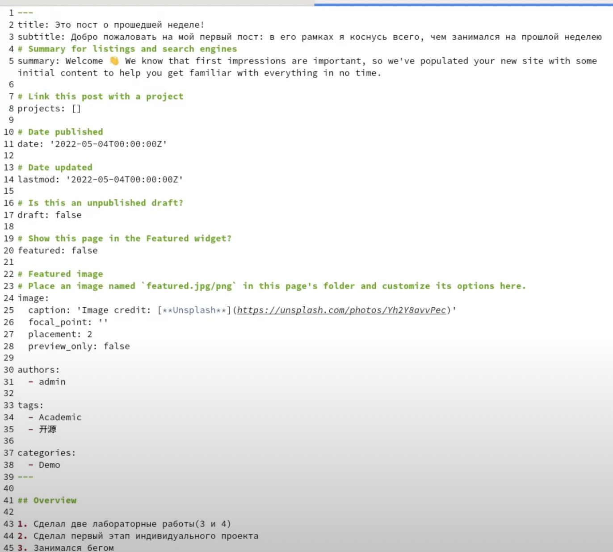

---
## Front matter
title: "Индивидуальный проект. 2 этап"
subtitle: "Добавление на сайт информации о себе"
author: "Федорина Эрнест Васильевич"

## Generic otions
lang: ru-RU
toc-title: "Содержание"

## Bibliography
bibliography: bib/cite.bib
csl: pandoc/csl/gost-r-7-0-5-2008-numeric.csl

## Pdf output format
toc: true # Table of contents
toc-depth: 2
lof: true # List of figures
lot: true # List of tables
fontsize: 12pt
linestretch: 1.5
papersize: a4
documentclass: scrreprt
## I18n polyglossia
polyglossia-lang:
  name: russian
  options:
	- spelling=modern
	- babelshorthands=true
polyglossia-otherlangs:
  name: english
## I18n babel
babel-lang: russian
babel-otherlangs: english
## Fonts
mainfont: PT Serif
romanfont: PT Serif
sansfont: PT Sans
monofont: PT Mono
mainfontoptions: Ligatures=TeX
romanfontoptions: Ligatures=TeX
sansfontoptions: Ligatures=TeX,Scale=MatchLowercase
monofontoptions: Scale=MatchLowercase,Scale=0.9
## Biblatex
biblatex: true
biblio-style: "gost-numeric"
biblatexoptions:
  - parentracker=true
  - backend=biber
  - hyperref=auto
  - language=auto
  - autolang=other*
  - citestyle=gost-numeric
## Pandoc-crossref LaTeX customization
figureTitle: "Рис."
tableTitle: "Таблица"
listingTitle: "Листинг"
lofTitle: "Список иллюстраций"
lotTitle: "Список таблиц"
lolTitle: "Листинги"
## Misc options
indent: true
header-includes:
  - \usepackage{indentfirst}
  - \usepackage{float} # keep figures where there are in the text
  - \floatplacement{figure}{H} # keep figures where there are in the text
---

# Цель работы

Научиться оформлять свой сайт, сохранять на нём изменения, а также научиться синхронизировать работу с файлами и репозиториями локальными и теми, что на github.

# Задание

Добавить к сайту данные о себе.

- Список добавляемых данных.
- Разместить фотографию владельца сайта.
- Разместить краткое описание владельца сайта (Biography).
- Добавить информацию об интересах (Interests).
- Добавить информацию от образовании (Education).
- Сделать пост по прошедшей неделе.
- Добавить пост на тему по выбору:
	Управление версиями. Git.
	Непрерывная интеграция и непрерывное развертывание (CI/CD).

# Теоретическое введение

Git — это самая популярная система контроля версий в мире. GitHub Pages — это бесплатный хостинг для статических файлов.

Если вы создали сайт и оставили его у себя на ПК, то посмотреть его можно только с вашего ПК. Чтобы открыть его с другого устройства, нужно перенести файлы сайта на другое устройство. Чтобы не переносить эти файлы на все устройства в мире, их нужно загружать в облачные хранилища. Облачные хранилища для сайтов называются хостингами.

# Работа над проектом

Зашли в локальный репозиторий с сайтом в blog/content/authors/admin и заменил квадратную фотографию шаблона на свою, назвав avatar (рис.1)

{ рис.1 }

 В том же каталоге каталоге открыл файл _index.md и начал вписывать свои данные вместо шаблонных. Написал краткую информацию о себе(рис.2)

{ рис.2 }

Заполнил графу "образование" (рис.3)

{ рис.3 }

Заполнил информацию о своих интересах (рис.4)

{ рис.4 }

Зашёл в content/post/getting-started, зашёл в файл index.md и начал писать свой пост вместо шаблона, добавил название, главную информацию, авторов и тд. (рис.5)

{ рис.5 }

В терминале прописал команду для создания ещё одного поста(про GIT) (рис.6)

{ рис.6 }

Зашёл в созданный каталог с постом и изменил файл index.md, тем самым написав ещё один пост (рис.7)

{ рис.7 }

В терминале зашли в каталог blog и синхронизировали изменения в локальном репозитории, закоммитили их и запушили их в main.

{ рис.8 }

Запускаем Hugo, переходим в /public, и коммитим все изменения уже на сайт, который находится на хостинге гитхаба. Пушим его в main.

{ рис.9}

Вот что получается на странице сайта(рис.10,11,12)

{ рис.10 }

{ рис.11 }

{ рис.12 }

# Выводы

Научились оформлять свой сайт, сохранять на нём изменения, а также научились синхронизировать работу с файлами и репозиториями локальными и теми, что на github.

