---
## Front matter
title: "Индивидуальный проект. 3 этап"
subtitle: "Добавление достижений к сайту"
author: "Федорина Эрнест Васильевич НКНбд-01-21"

## Generic otions
lang: ru-RU
toc-title: "Содержание"

## Bibliography
bibliography: bib/cite.bib
csl: pandoc/csl/gost-r-7-0-5-2008-numeric.csl

## Pdf output format
toc: true # Table of contents
toc-depth: 2
lof: true # List of figures
lot: true # List of tables
fontsize: 12pt
linestretch: 1.5
papersize: a4
documentclass: scrreprt
## I18n polyglossia
polyglossia-lang:
  name: russian
  options:
	- spelling=modern
	- babelshorthands=true
polyglossia-otherlangs:
  name: english
## I18n babel
babel-lang: russian
babel-otherlangs: english
## Fonts
mainfont: PT Serif
romanfont: PT Serif
sansfont: PT Sans
monofont: PT Mono
mainfontoptions: Ligatures=TeX
romanfontoptions: Ligatures=TeX
sansfontoptions: Ligatures=TeX,Scale=MatchLowercase
monofontoptions: Scale=MatchLowercase,Scale=0.9
## Biblatex
biblatex: true
biblio-style: "gost-numeric"
biblatexoptions:
  - parentracker=true
  - backend=biber
  - hyperref=auto
  - language=auto
  - autolang=other*
  - citestyle=gost-numeric
## Pandoc-crossref LaTeX customization
figureTitle: "Рис."
tableTitle: "Таблица"
listingTitle: "Листинг"
lofTitle: "Список иллюстраций"
lotTitle: "Список таблиц"
lolTitle: "Листинги"
## Misc options
indent: true
header-includes:
  - \usepackage{indentfirst}
  - \usepackage{float} # keep figures where there are in the text
  - \floatplacement{figure}{H} # keep figures where there are in the text
---

# Цель работы

Научиться добавлять достижения на наш сайт с помощью шаблона

# Задание

Добавить к сайту достижения.

Список достижений.
Добавить информацию о навыках (Skills).
Добавить информацию об опыте (Experience).
Добавить информацию о достижениях (Accomplishments).
Сделать пост по прошедшей неделе.
Добавить пост на тему по выбору:
Легковесные языки разметки.
Языки разметки. LaTeX.
Язык разметки Markdown.

# Теоретическое введение

Git — это самая популярная система контроля версий в мире. GitHub Pages — это бесплатный хостинг для статических файлов.

Если вы создали сайт и оставили его у себя на ПК, то посмотреть его можно только с вашего ПК. Чтобы открыть его с другого устройства, нужно перенести файлы сайта на другое устройство. Чтобы не переносить эти файлы на все устройства в мире, их нужно загружать в облачные хранилища. Облачные хранилища для сайтов называются хостингами.

# Работа над проектом

Начали работать со skills, нашли название нужных нам логотипов в fab(рис.1)

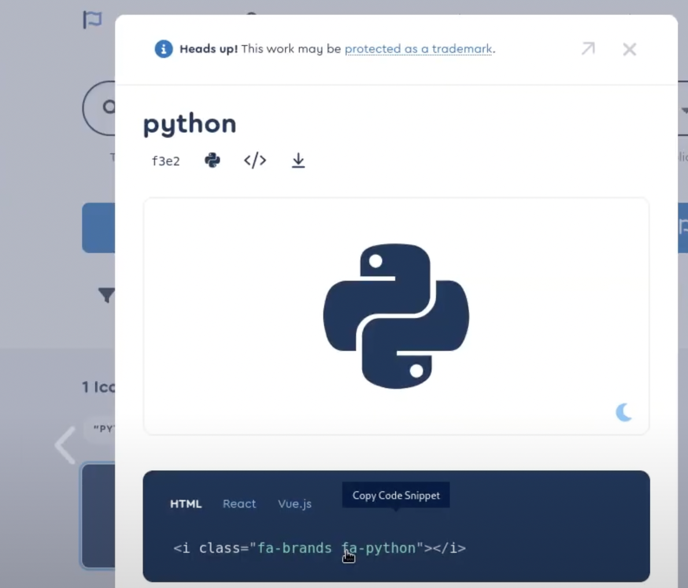{ рис.1 }

 Перешли в skills.md и начали редактирование(рис.2)

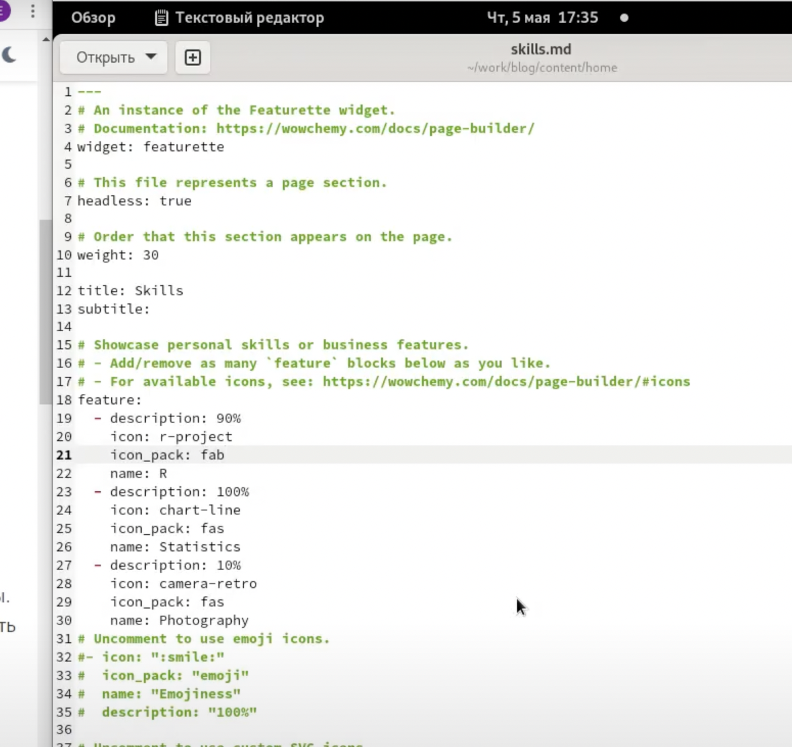{ рис.2 }

Вот что получилось в разделе skills(рис.3)

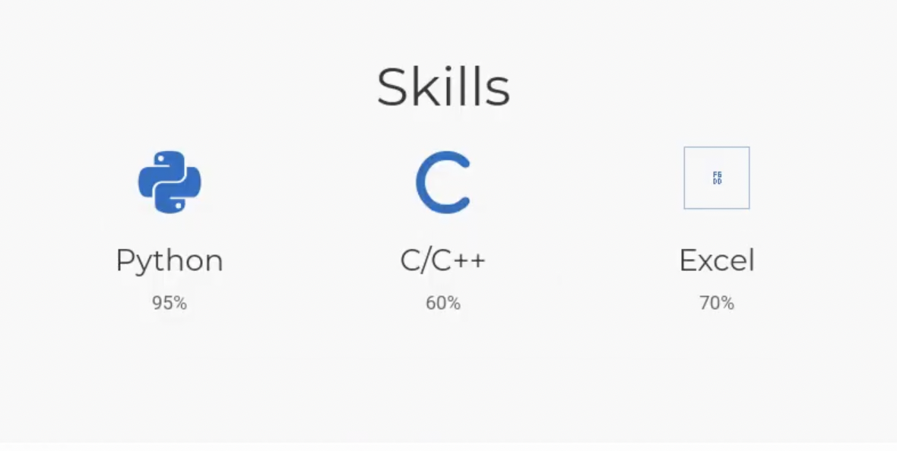{ рис.3 }

Зашли в файл experience.md и начали его редактирование (рис.4)

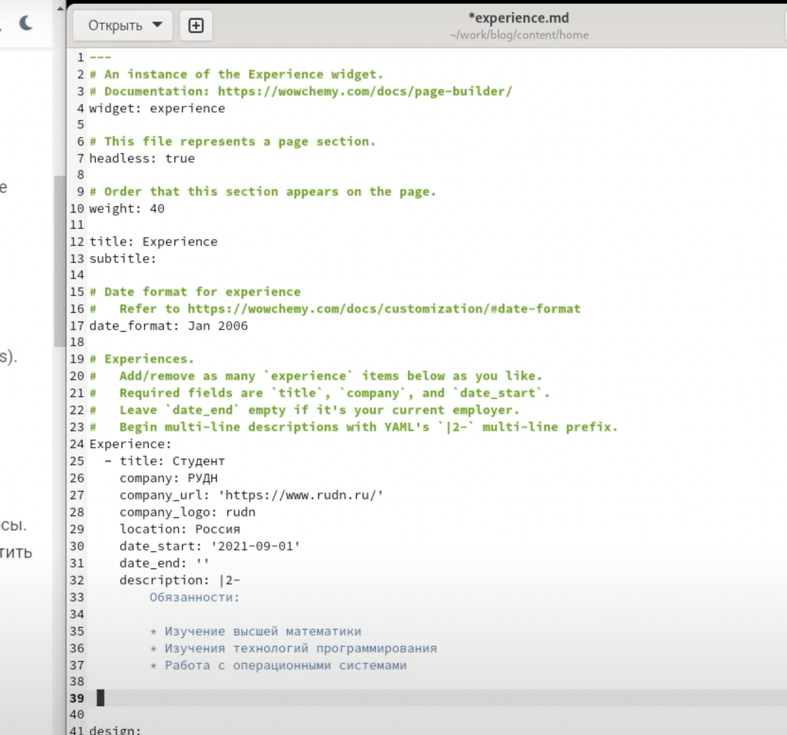{ рис.4 }

Нашли в интернете логотипы нужных нам мест, где получали опыт и сохранили их в assets/media/icons(рис.5)

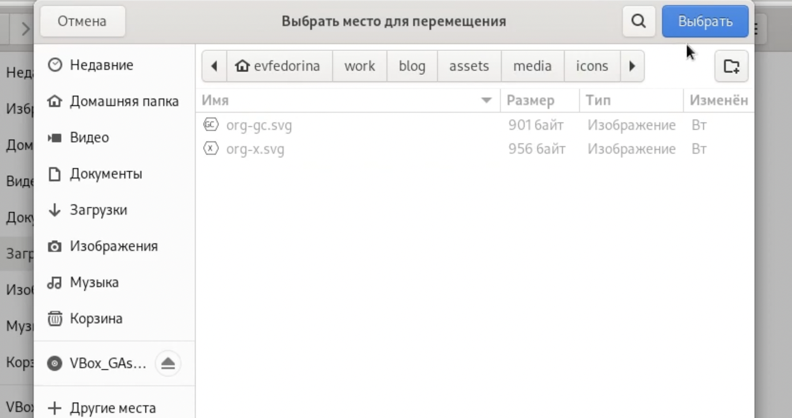{ рис.5 }

Результат редактирования experience (рис.6)

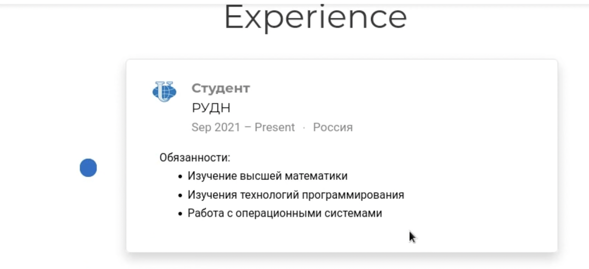{ рис.6 }

Начали редактирование файла accomplishments.md (рис.7)

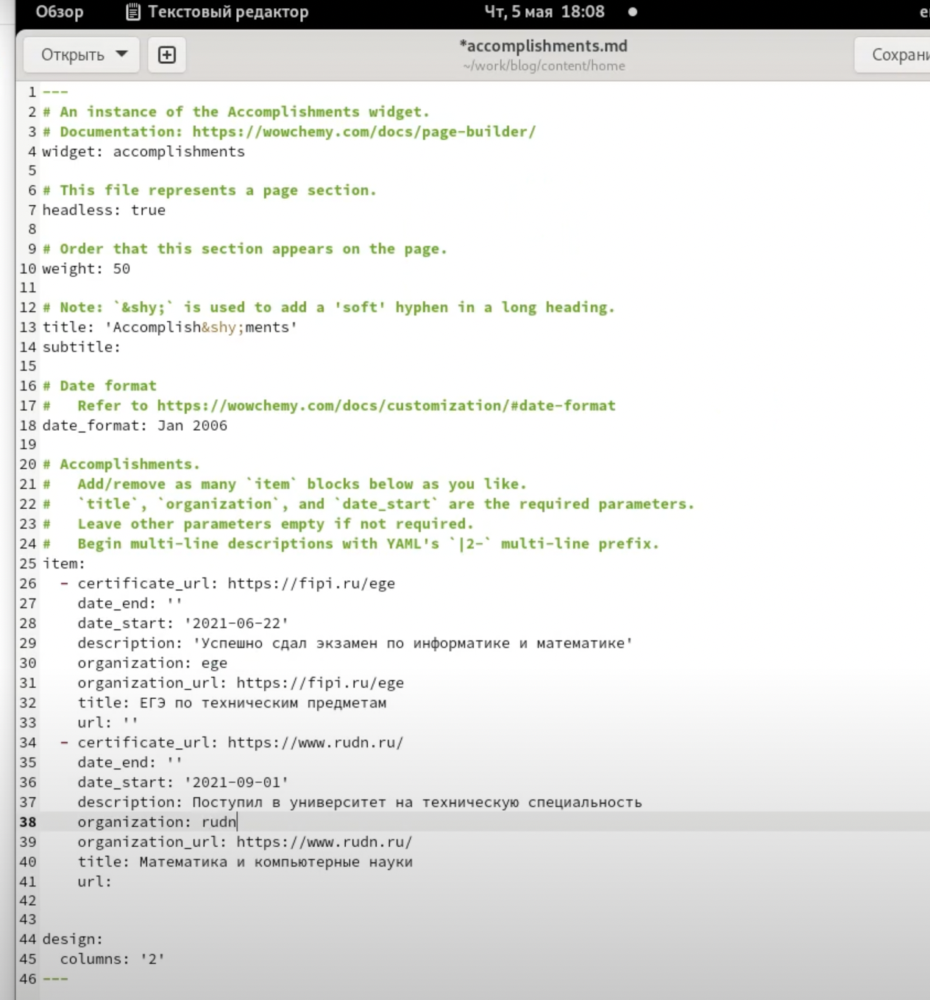{ рис.7 }

Нашли в интернете нужные картинки и сохранили их в public/media/icons/brands

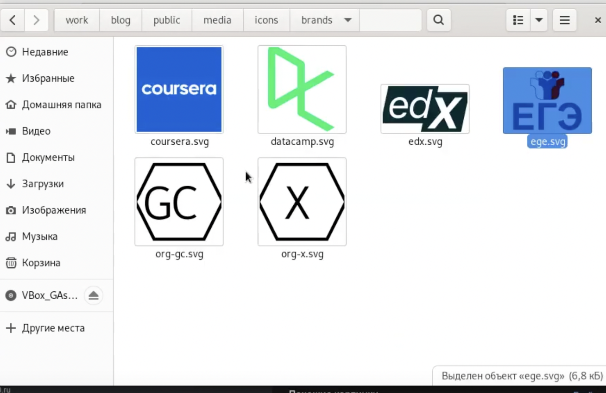{ рис.8 }

Результат заполнения раздела accomplishments

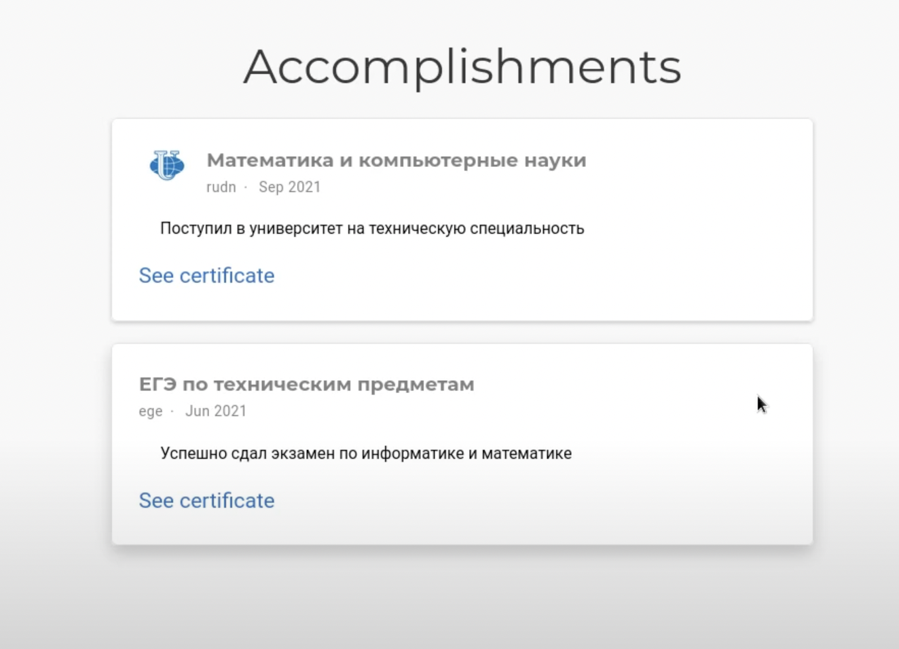{ рис.9}

Используя умение писать новые посты, сделали два: про markdown  и просто о прошедшей неделе, вот результат их создания.(рис.10,11)

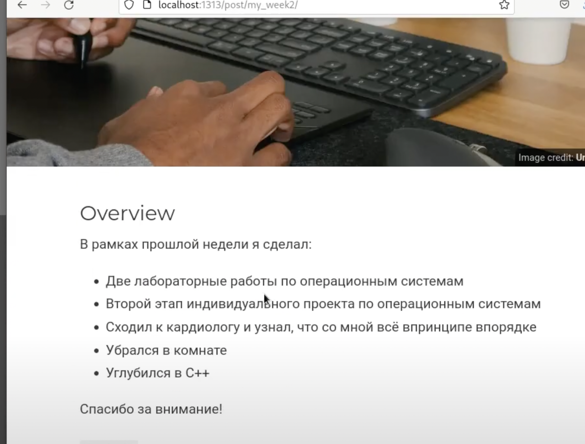{ рис.10 }

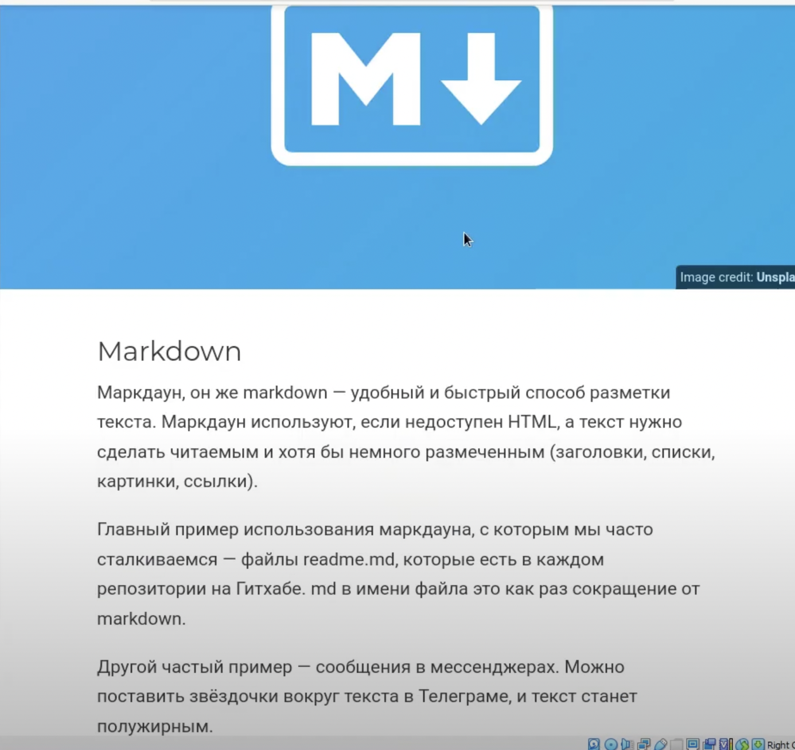{ рис.11 }

# Выводы

Научились добавлять достижения на сайт с помощью шаблонов.

