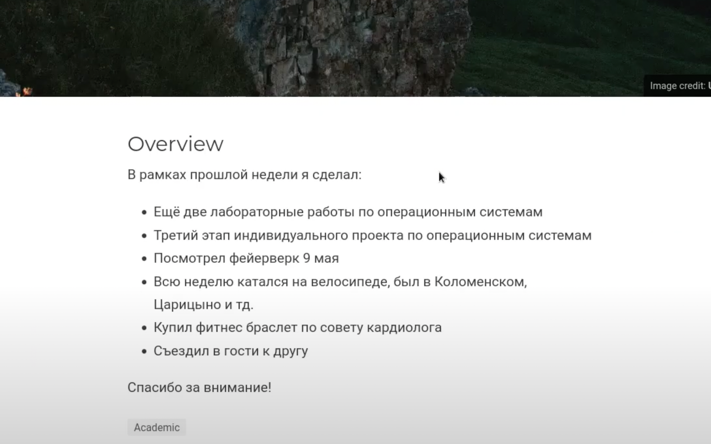

---
## Front matter
title: "Индивидуальный проект. 4 этап"
subtitle: "Добавление ссылки на научные и библиометрические ресурсы"
author: "Федорина Эрнест Васильевич НКНбд-01-21"

## Generic otions
lang: ru-RU
toc-title: "Содержание"

## Bibliography
bibliography: bib/cite.bib
csl: pandoc/csl/gost-r-7-0-5-2008-numeric.csl

## Pdf output format
toc: true # Table of contents
toc-depth: 2
lof: true # List of figures
lot: true # List of tables
fontsize: 12pt
linestretch: 1.5
papersize: a4
documentclass: scrreprt
## I18n polyglossia
polyglossia-lang:
  name: russian
  options:
	- spelling=modern
	- babelshorthands=true
polyglossia-otherlangs:
  name: english
## I18n babel
babel-lang: russian
babel-otherlangs: english
## Fonts
mainfont: PT Serif
romanfont: PT Serif
sansfont: PT Sans
monofont: PT Mono
mainfontoptions: Ligatures=TeX
romanfontoptions: Ligatures=TeX
sansfontoptions: Ligatures=TeX,Scale=MatchLowercase
monofontoptions: Scale=MatchLowercase,Scale=0.9
## Biblatex
biblatex: true
biblio-style: "gost-numeric"
biblatexoptions:
  - parentracker=true
  - backend=biber
  - hyperref=auto
  - language=auto
  - autolang=other*
  - citestyle=gost-numeric
## Pandoc-crossref LaTeX customization
figureTitle: "Рис."
tableTitle: "Таблица"
listingTitle: "Листинг"
lofTitle: "Список иллюстраций"
lotTitle: "Список таблиц"
lolTitle: "Листинги"
## Misc options
indent: true
header-includes:
  - \usepackage{indentfirst}
  - \usepackage{float} # keep figures where there are in the text
  - \floatplacement{figure}{H} # keep figures where there are in the text
---

# Цель работы

Научиться добавлять ссылки со значками на свой сайт

# Задание

Добавить к сайту ссылки на научные и библиометрические ресурсы.

Зарегистрироваться на соответствующих ресурсах и разместить на них ссылки на сайте.

Сделать пост по прошедшей неделе.

Добавить пост на тему по выбору:
- Оформление отчёта.
- Создание презентаций.
- Работа с библиографией.

# Теоретическое введение

Git — это самая популярная система контроля версий в мире. GitHub Pages — это бесплатный хостинг для статических файлов.

Если вы создали сайт и оставили его у себя на ПК, то посмотреть его можно только с вашего ПК. Чтобы открыть его с другого устройства, нужно перенести файлы сайта на другое устройство. Чтобы не переносить эти файлы на все устройства в мире, их нужно загружать в облачные хранилища. Облачные хранилища для сайтов называются хостингами.

# Работа над проектом

Начали работать с файлом index.md в каталоге content/authors/admin, нашли название нужных нам логотипов в fab и вставили нужные ссылки на свои профили в разных ресурсах(рис.1,2)

{ рис.1 }

{ рис.2 }

Используя умение писать новые посты, сделали два: про оформление отчёта  и просто о прошедшей неделе, вот результат их создания.(рис.4,6)

{ рис.4 }

{ рис.6 }

# Выводы

Научились добавлять ссылки со значками на свой сайт

