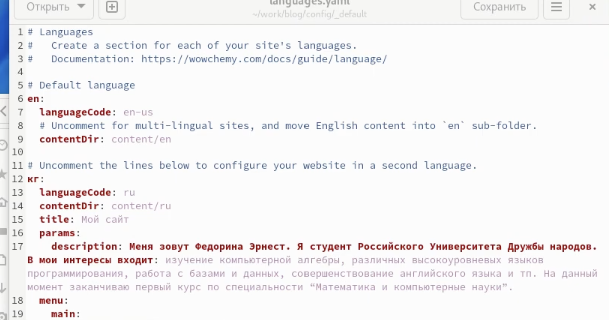
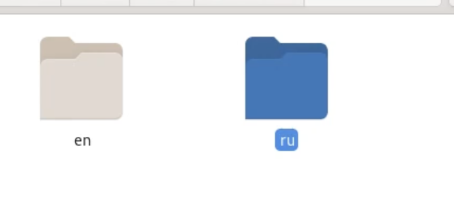
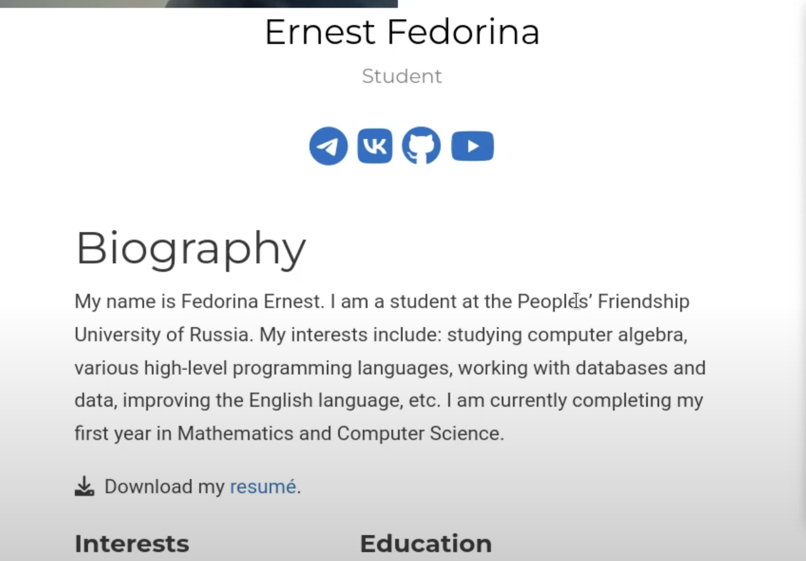
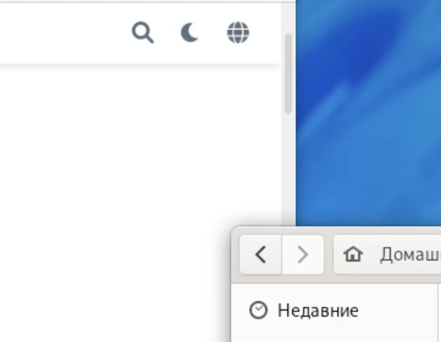
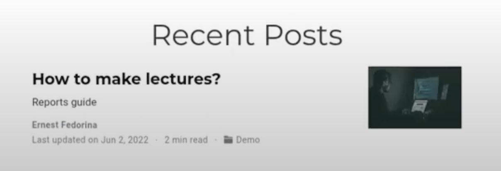
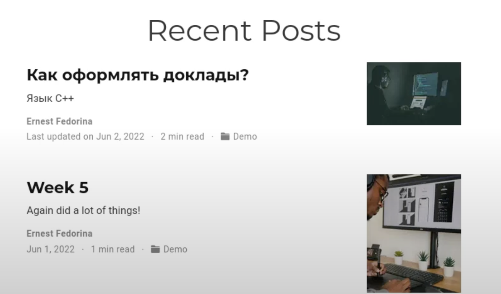

---
## Front matter
title: "Индивидуальный проект. 6 этап"
subtitle: "Размещение двуязычного сайта на Github."
author: "Федорина Эрнест Васильевич НКНбд-01-21"

## Generic otions
lang: ru-RU
toc-title: "Содержание"

## Bibliography
bibliography: bib/cite.bib
csl: pandoc/csl/gost-r-7-0-5-2008-numeric.csl

## Pdf output format
toc: true # Table of contents
toc-depth: 2
lof: true # List of figures
lot: true # List of tables
fontsize: 12pt
linestretch: 1.5
papersize: a4
documentclass: scrreprt
## I18n polyglossia
polyglossia-lang:
  name: russian
  options:
	- spelling=modern
	- babelshorthands=true
polyglossia-otherlangs:
  name: english
## I18n babel
babel-lang: russian
babel-otherlangs: english
## Fonts
mainfont: PT Serif
romanfont: PT Serif
sansfont: PT Sans
monofont: PT Mono
mainfontoptions: Ligatures=TeX
romanfontoptions: Ligatures=TeX
sansfontoptions: Ligatures=TeX,Scale=MatchLowercase
monofontoptions: Scale=MatchLowercase,Scale=0.9
## Biblatex
biblatex: true
biblio-style: "gost-numeric"
biblatexoptions:
  - parentracker=true
  - backend=biber
  - hyperref=auto
  - language=auto
  - autolang=other*
  - citestyle=gost-numeric
## Pandoc-crossref LaTeX customization
figureTitle: "Рис."
tableTitle: "Таблица"
listingTitle: "Листинг"
lofTitle: "Список иллюстраций"
lotTitle: "Список таблиц"
lolTitle: "Листинги"
## Misc options
indent: true
header-includes:
  - \usepackage{indentfirst}
  - \usepackage{float} # keep figures where there are in the text
  - \floatplacement{figure}{H} # keep figures where there are in the text
---

# Цель работы

Научиться делать сайты двуязычными.

# Задание

- Сделать поддержку английского и русского языков.
- Разместить элементы сайта на обоих языках.
- Разместить контент на обоих языках.
- Сделать пост по прошедшей неделе.
- Добавить пост на тему по выбору (на двух языках).

# Теоретическое введение

Git — это самая популярная система контроля версий в мире. GitHub Pages — это бесплатный хостинг для статических файлов.

Если вы создали сайт и оставили его у себя на ПК, то посмотреть его можно только с вашего ПК. Чтобы открыть его с другого устройства, нужно перенести файлы сайта на другое устройство. Чтобы не переносить эти файлы на все устройства в мире, их нужно загружать в облачные хранилища. Облачные хранилища для сайтов называются хостингами.

# Работа над проектом

Зашли в config/_default и следуя инструкции добавили поддержку русского языка, там же добавили русскоязычные иконки меню(рис.1)

{ рис.1 }

Дублировали содержимое /content в два подкаталога, ru и en с разными локализациями, изменили все остальные элементы, контент, биографию и тд, чтобы получилась чисто англо- и русско-язычная версия(рис.2,3)

{ рис.2 }

{ рис.3 }

Добавили переключатель языков(рис.4)

{ рис.4 }

Используя полученные в прошлых этапах навыки сделали два поста: на тему по выбору и по предыдущей неделе. Все посты сделали на двух языках для двух версий сайта(рис.5,6)

{ рис.5 }

{ рис.6 }

# Выводы

Научились делать сайты двуязычными

